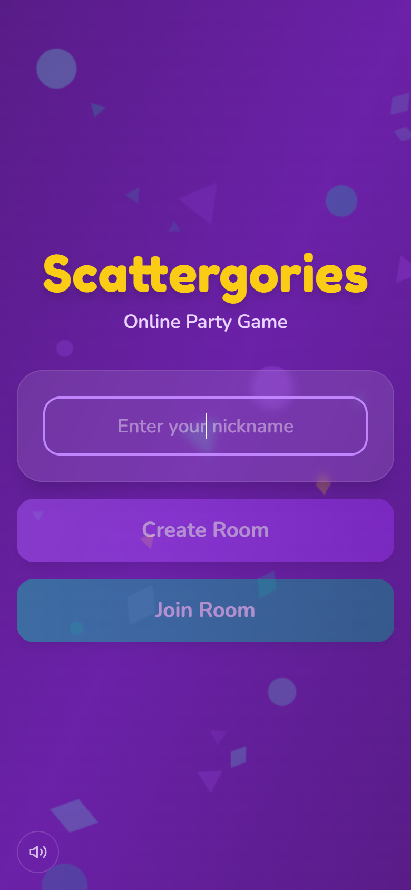
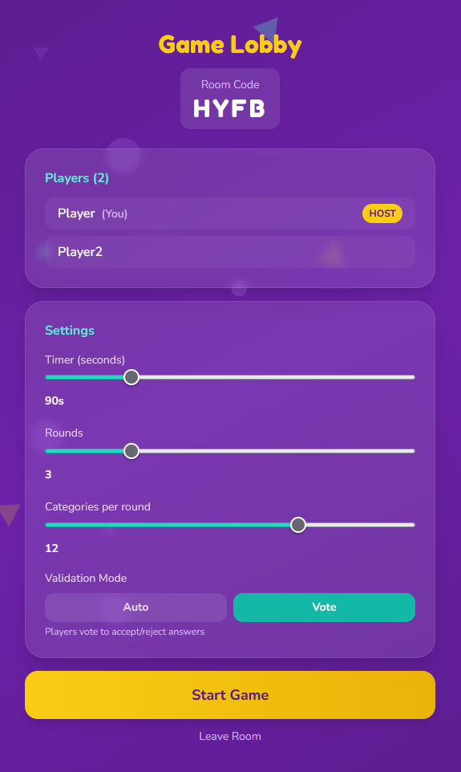
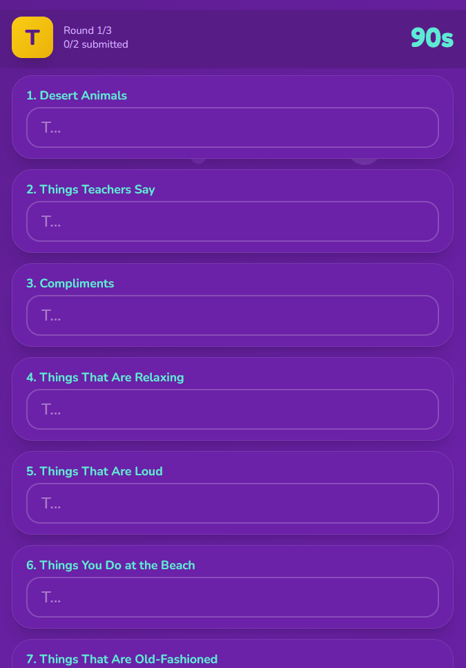
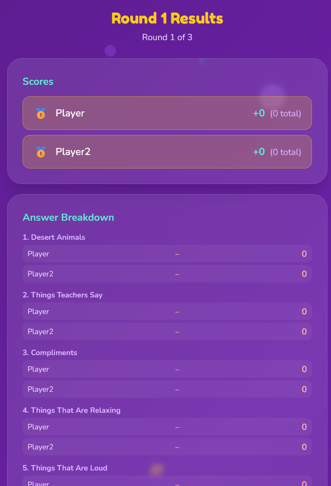

# Scattergories Online

A real-time multiplayer Scattergories party game built with React, Node.js, and Socket.IO.

<p align="center">
  
  
  
  
</p>

## Features

- **Real-time multiplayer** — Create or join rooms with a 4-letter code
- **Voting mode** — Players vote to accept or reject each other's answers
- **Letter enforcement** — Answers that don't start with the round letter are automatically rejected and highlighted in red during play and voting
- **Tie handling** — Tied players share the same podium position (🥇🥇) on both round and final results screens
- **Disconnect & reconnect** — Players who lose connection (e.g. switching apps on mobile) are held in the room for 30 seconds and silently rejoined with full game state restored
- **Refresh protection** — Browser warns before leaving mid-game; accidental refreshes reconnect the player automatically via session storage
- **500+ categories** — Huge variety so every game feels different
- **Procedural audio** — Background music and sound effects via Web Audio API (no files needed)
- **Animated backgrounds** — Floating particle effects across all screens
- **Letter roll animation** — Slot-machine style letter reveal at the start of each round
- **10-second warning** — Audio beep and visual alert when time is running low
- **Bilingual** — Full English and Malay (Bahasa Melayu) support
- **Mobile-friendly** — Responsive design that works on phones and tablets

## Tech Stack

- **Frontend**: React, TypeScript, Vite, Tailwind CSS
- **Backend**: Node.js, Express, Socket.IO
- **Audio**: Web Audio API (procedurally generated)

## Getting Started

```bash
npm install
npm run dev
```

Opens on [http://localhost:5173](http://localhost:5173) (client) with the server on port 3001.

## How to Play

1. Enter a nickname and create a room
2. Share the room code with friends
3. Adjust settings (timer, rounds, categories, validation mode)
4. Each round, a random letter is rolled — come up with answers starting with that letter for each category
5. After time's up, vote on each other's answers (answers with the wrong letter are automatically rejected)
6. Unique valid answers score 1 point — duplicates and wrong-letter answers get nothing!
7. Highest total score after all rounds wins — ties are shown on the podium together

## License

All Rights Reserved. See [LICENSE](LICENSE) for details.
